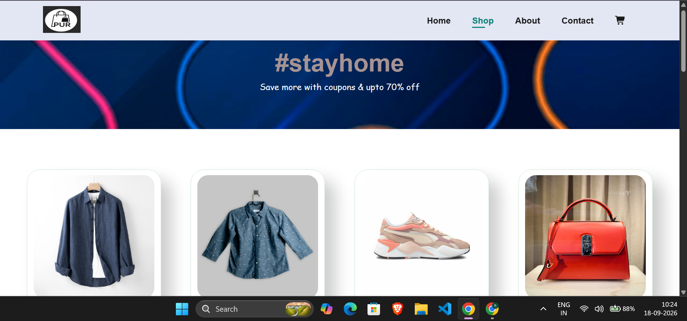
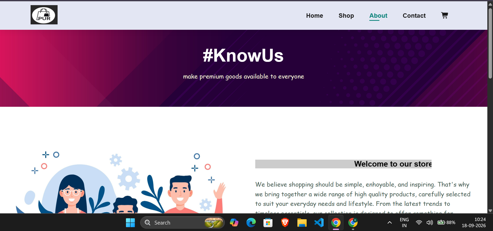
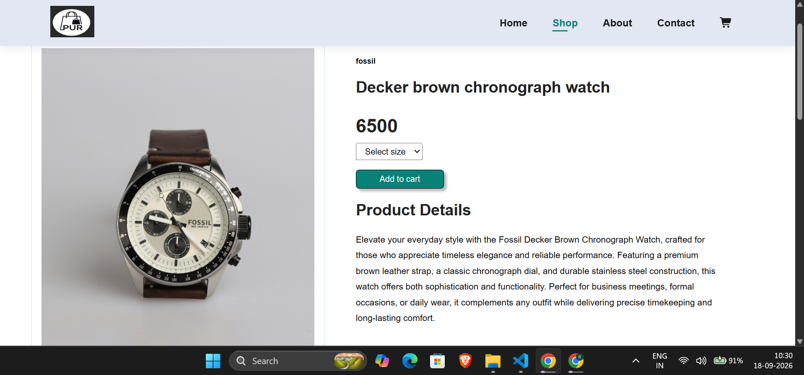
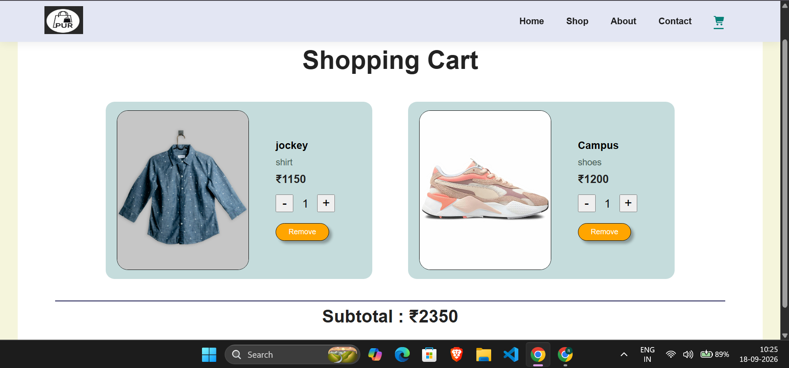

# 🛍️ Shop Pur - E-Commerce Website

A responsive e-commerce website built using HTML, CSS, and JavaScript.

## 🌐 Live Demo

[Visit Shop Pur](https://shop-pur-e-commerce.vercel.app/)

## 📖 Project Overview

Shop Pur is a responsive e-commerce website designed to provide a simple and user-friendly online shopping experience.
The website includes multiple pages for browsing products, viewing product details, managing the shopping cart, and learning more about the store.

## ✨ Features

- 🛍️ Browse products through the shop page
- 🔍 View individual product details
- 🛒 Add products to the shopping cart
- 🔢 Update product quantities in the cart
- 📱 Responsive design for different screen sizes
- 📄 Dedicated About and Contact pages

## 🛠️ Technologies Used

- HTML5
- CSS3
- JavaScript

## 📂 Project Structure

```text
E-commerce-website/
├── images/
├── ProductDescription/
├── screenshots/
├── about.html
├── cart.css
├── cart.html
├── contact.html
├── index.html
├── logo.jpg
├── script.js
├── shop.html
├── style.css
└── README.md
```

## 🚀 Getting Started

### Clone the repository

```bash
git clone https://github.com/RachitRawat720/E-commerce-website.git

cd E-commerce-website
```

## 📚 What I Learned

Through this project, I practiced:

- Building responsive web pages using HTML5
- Styling websites with CSS3
- Adding interactivity using JavaScript
- Creating product and shopping cart interfaces
- Organizing a multi-page frontend project
- Deploying a website using Vercel

## 🔮 Future Improvements

- Add user authentication
- Connect the website to a backend and database
- Add a real payment gateway
- Add product search and filtering
- Improve shopping cart functionality
- Add an admin dashboard for product management
- 
## 📸 Screenshots

### 🏠 Home Page


### 🛍️ Shop Page


### 🛍️ About Page


### 🛍️ Contact Page


### 👕 Product Details


### 🛒 Shopping Cart


## 🔮 Future Improvements

- Add user authentication
- Connect the website to a backend and database
- Add a real payment gateway
- Add product search and filtering
- Improve shopping cart functionality
- Add an admin dashboard for product management

## 👨‍💻 Author

**Rachit Rawat**

- GitHub: [@RachitRawat720](https://github.com/RachitRawat720)
